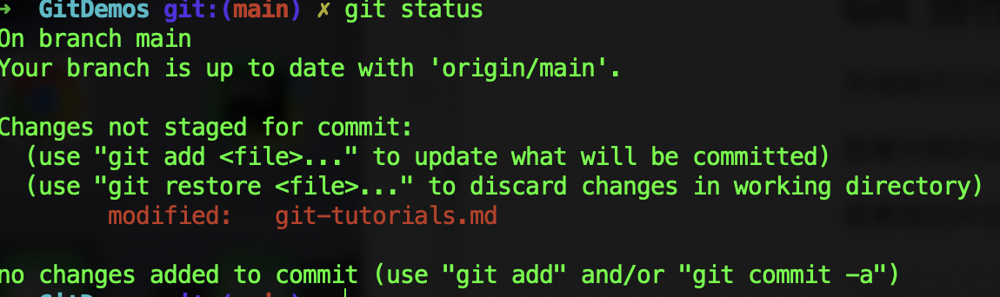
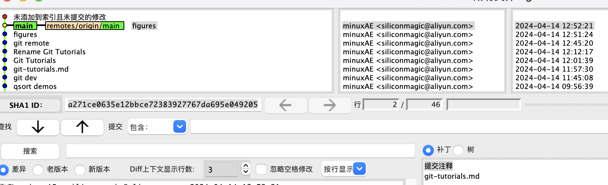

# Git Tutorials

查看系统的环境变量：`echo $PATH`

查看git的版本：`git --version`

## Git 协作

本地库可以对应多个远程库

查看关联的远程库：`git remote show`

查看指定的远程库：`git remote show origin`

```
...
HEAD branch: main
  Remote branches:
    better_random tracked
    main          tracked
    test_branch   tracked
  Local branch configured for 'git pull':
    main merges with remote main
  Local ref configured for 'git push':
    main pushes to main (up to date)
```

远程推送：`git push`




将本地的`main`和远程的`origin/main`进行同步

查看所有分支：`git branch -a`，加上版本信息可以使用：`git branch -av`

`git fetch`只负责下载，不进行合并

## gitk和git gui

MAC机器在默认`Xcode`中提供的`git`没有安装`gitk`, 需要更换为`homebrew`中安装的`git`

1.更新`homebrew`: `brew update`

2.安装`git`:`brew install git`

3.安装`gitk`: `brew install git-gui`

4.国内安装走的是清华镜像，`zsh`界面变成了中文，可以通过修改`~/.bash_profile`文件调整

```
export GIT=/opt/homebrew/bin/git # 将GIT定位到homebrew安装的
alias git='LANG=en_GB git' # 英文界面
```

使用命令`gitk`可以开启MAC中的GUI



`gitk`也可以修改为英文界面：`alias gitk='LANG=en_GB gitk'`

刷新配置文件：`source ~/.bash_profile`

输入命令`git gui`可以打开GUI管理界main

## git refspec

`git config --global alias.xxx yyy` 对操作起一个别名

`git config --global alias.ui '!gitk'` 对外部命令添加别名， 执行`git ui`相当于执行`gitk`

创建对应远程分支的命令：`git checkout -b dev origin/dev`,  该操作在本地创建了分支`dev`，且追踪远程`orgin/dev`分支

本地分支建立追踪关系：`git push -u origin test`

设定远程分支追踪：`git checkout --track origin/test`

删除远程分支

方法1:`git push origin :dev`(将空分支推送到远程)

方法2:`git push origin --delete dev`

如果本地分支和远程分支名字不一样

```
git push --set-upstream --set-upstream origin dev:dev2
```

推送时需要使用命令：`git push origin HEAD:dev2`

或者使用：`git push origin dev:dev2`

本地和远程同名分支推送：`git push --set-upstream origin dev` (本地和远程分支名字都是dev)

`push`操作的完整命令：`git push origin src:dest`

`pull`操作的完整命令：`git pull origin src:dest`

`HEAD`指向当前所在分支的引用标识符，文件内部不包含`SHA-1`值，包含指向另一个引用的指针

执行`git commit`时，会创建一个`commit`对象，并且将这个对象的`parent`指针设置为`HEAD`所指向的`SHA-1`值

对于`HEAD`修改的操作会记录在`git reflog`中

`ORIG_HEAD`记录了远程`HEAD`的`SHA-1`

`FETCH_HEAD`记录了拉取代码

### 标签

`git push origin --tags`将本地所有标签推送到远程仓库

远程标签删除：`git push origin --delete tag <version>`

本地标签删除：`git tag -d <version>`

本地标签推送到远程（完整语法）：`git push origin refs/tags/<version>:refs/tags/<version>`

在缺省情况下，`refspec`会被`git remote add`命令自动生成，Git会获取远端上`refs/heads`下所有引用，并将他们写到本地的`refs/remote/origin`目录下

查看远程main分支的历史记录：

```
git log origin/main
git log remotes/origin/main
git log refs/remotes/origin/main
```

本地分支的信息存储在`.git/refs/heads`下

远程分支信息存储在`.git/refs/remotes`下

将远程main分支拉取到本地远程库的mymain分支下：

```
git fetch origin main:refs/remotes/origin/mymain
```

此时mymain分支处于stale状态，因为没有本地分支在track

建立追踪远程分支mymain的本地分支：

```
git checkout --track origin/mymain
```

## git gc

执行`git gc`可以将本地、远程、标签等信息压缩到`.git/packed-refs`中


